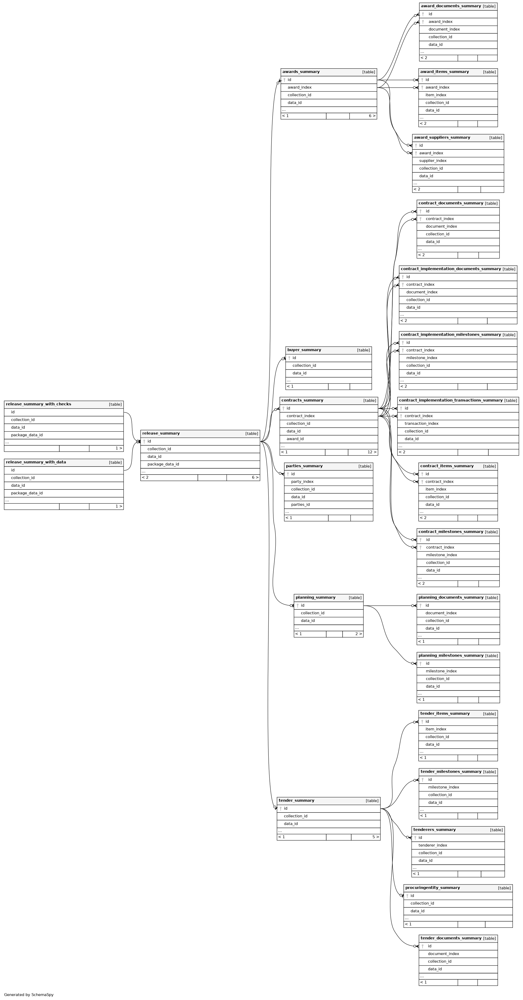

Database tables reference
=========================

Introduction
------------

How tables are created
~~~~~~~~~~~~~~~~~~~~~~

The :ref:`add-view` command *without* the ``--dontbuild`` flag creates all the tables below.

Otherwise, the :ref:`add-view` command *with* the ``--dontbuild`` flag creates the :ref:`metadata` tables only, the :ref:`field-counts` command creates the :ref:`fields` tables, and the :ref:`refresh-views` command creates the rest.

How tables are related
~~~~~~~~~~~~~~~~~~~~~~

All summary tables have an ``id`` column and a ``release_type`` column. This ``id`` column refers to the ``id`` column in the ``release_summary`` table. The ``table_id`` column in the ``release_summary`` table refers the ``id`` column in either Kingfisher Process' ``release``, ``record`` or ``compiled_release`` table; the table is indicated by the ``release_type`` column.

Note that, in the case of Kingfisher Process' ``record`` table, the record's data's ``compiledRelease`` is used in summaries.

Foreign key relationships exist on all `tables <https://www.postgresql.org/docs/current/sql-createtable.html>`__ (but not `views <https://www.postgresql.org/docs/current/sql-createview.html>`__) within a schema, as shown in the Entity Relationship Diagram below (click on the image and zoom in to read more easily).

This diagram can help to identify JOIN conditions. For example, all tables can be joined with the ``release_summary``, ``release_summary_with_data`` and ``release_summary_with_data`` tables on the ``id`` column.

Some tables have composite foreign keys. These are shown as two lines from one table to another in the diagram. To join such tables:

.. code-block:: sql

   SELECT *
   FROM awards_document_summary
   JOIN awards_summary
     ON awards_summary.id = awards_document_summary.id AND
        awards_summary.award_index = awards_document_summary.award_index 

Or, more briefly:

.. code-block:: bash

   SELECT *
   FROM awards_document_summary
   JOIN awards_summary USING (id, award_index)

.. _metadata:

Metadata
--------

These tables are created and populated by the :ref:`add-view` command.

selected_collections
~~~~~~~~~~~~~~~~~~~~

This table contains the collection IDs that the user provided when creating the schema.

If you need to change the collections to be summarized, delete the schema with the :ref:`delete-view` command and re-create it with the :ref:`add-view` command. This ensures that the schema's name reflects its contents. (It is possible to change the collections to be summarized by inserting and/or deleting rows in this table and then re-running the :ref:`refresh-views` and :ref:`field-counts` commands, but this will take the same time and might result in the schema having an incorrect name.)

.. csv-table::
   :header-rows: 1
   :widths: 10, 10, 40
   :file: definitions/selected_collections.csv

note
~~~~

This table contains the note that the user provided when creating the schema.

.. csv-table::
   :header-rows: 1
   :widths: 10, 10, 40
   :file: definitions/note.csv

.. _fields:

Fields
------

These tables are created and populated by the :ref:`field-counts` command (or the :ref:`add-view` command if the ``--dontbuild`` flag isn't set).

.. _field-counts-table:

field_counts
~~~~~~~~~~~~

.. csv-table::
   :header-rows: 1
   :widths: 10, 10, 40
   :file: definitions/field_counts.csv

.. _db-releases:

Releases
--------

These tables are created and populated by ``008-release.sql``.

release_summary
~~~~~~~~~~~~~~~

.. csv-table::
   :header-rows: 1
   :widths: 10, 10, 40
   :file: definitions/release_summary.csv

release_summary_with_data
~~~~~~~~~~~~~~~~~~~~~~~~~

.. csv-table::
   :header-rows: 1
   :widths: 10, 10, 40
   :file: definitions/release_summary_with_data.csv

release_summary_with_checks
~~~~~~~~~~~~~~~~~~~~~~~~~~~

.. csv-table::
   :header-rows: 1
   :widths: 10, 10, 40
   :file: definitions/release_summary_with_checks.csv

.. _db-parties:

Parties
-------

These tables are created and populated by ``003-buyer-procuringentity-tenderer.sql``.

parties_summary
~~~~~~~~~~~~~~~

.. csv-table::
   :header-rows: 1
   :widths: 10, 10, 40
   :file: definitions/parties_summary.csv

buyer_summary
~~~~~~~~~~~~~

.. csv-table::
   :header-rows: 1
   :widths: 10, 10, 40
   :file: definitions/buyer_summary.csv

procuringEntity_summary
~~~~~~~~~~~~~~~~~~~~~~~

.. csv-table::
   :header-rows: 1
   :widths: 10, 10, 40
   :file: definitions/procuringEntity_summary.csv

tenderers_summary
~~~~~~~~~~~~~~~~~

.. csv-table::
   :header-rows: 1
   :widths: 10, 10, 40
   :file: definitions/tenderers_summary.csv

.. _db-planning:

Planning section
----------------

These tables are created and populated by ``004-planning.sql``.

planning_summary
~~~~~~~~~~~~~~~~

.. csv-table::
   :header-rows: 1
   :widths: 10, 10, 40
   :file: definitions/planning_summary.csv

planning_documents_summary
~~~~~~~~~~~~~~~~~~~~~~~~~~

.. csv-table::
   :header-rows: 1
   :widths: 10, 10, 40
   :file: definitions/planning_documents_summary.csv

planning_milestones_summary
~~~~~~~~~~~~~~~~~~~~~~~~~~~

.. csv-table::
   :header-rows: 1
   :widths: 10, 10, 40
   :file: definitions/planning_milestones_summary.csv

.. _db-tender:

Tender section
--------------

These tables are created and populated by ``005-tender.sql``.

tender_summary
~~~~~~~~~~~~~~

.. csv-table::
   :header-rows: 1
   :widths: 10, 10, 40
   :file: definitions/tender_summary.csv

tender_summary_with_data
~~~~~~~~~~~~~~~~~~~~~~~~

.. csv-table::
   :header-rows: 1
   :widths: 10, 10, 40
   :file: definitions/tender_summary_with_data.csv

tender_items_summary
~~~~~~~~~~~~~~~~~~~~

.. csv-table::
   :header-rows: 1
   :widths: 10, 10, 40
   :file: definitions/tender_items_summary.csv

tender_documents_summary
~~~~~~~~~~~~~~~~~~~~~~~~

.. csv-table::
   :header-rows: 1
   :widths: 10, 10, 40
   :file: definitions/tender_documents_summary.csv

tender_milestones_summary
~~~~~~~~~~~~~~~~~~~~~~~~~

.. csv-table::
   :header-rows: 1
   :widths: 10, 10, 40
   :file: definitions/tender_milestones_summary.csv

.. _db-awards:

Awards section
--------------

These tables are created and populated by ``006-awards.sql``.

awards_summary
~~~~~~~~~~~~~~

.. csv-table::
   :header-rows: 1
   :widths: 10, 10, 40
   :file: definitions/awards_summary.csv

award_suppliers_summary
~~~~~~~~~~~~~~~~~~~~~~~

.. csv-table::
   :header-rows: 1
   :widths: 10, 10, 40
   :file: definitions/award_suppliers_summary.csv

award_items_summary
~~~~~~~~~~~~~~~~~~~

.. csv-table::
   :header-rows: 1
   :widths: 10, 10, 40
   :file: definitions/award_items_summary.csv

award_documents_summary
~~~~~~~~~~~~~~~~~~~~~~~

.. csv-table::
   :header-rows: 1
   :widths: 10, 10, 40
   :file: definitions/award_documents_summary.csv

.. _db-contracts:

Contracts section
-----------------

These tables are created and populated by ``007-contracts.sql``.

contracts_summary
~~~~~~~~~~~~~~~~~

.. csv-table::
   :header-rows: 1
   :widths: 10, 10, 40
   :file: definitions/contracts_summary.csv

contract_items_summary
~~~~~~~~~~~~~~~~~~~~~~

.. csv-table::
   :header-rows: 1
   :widths: 10, 10, 40
   :file: definitions/contract_items_summary.csv

contract_documents_summary
~~~~~~~~~~~~~~~~~~~~~~~~~~

.. csv-table::
   :header-rows: 1
   :widths: 10, 10, 40
   :file: definitions/contract_documents_summary.csv

contract_milestones_summary
~~~~~~~~~~~~~~~~~~~~~~~~~~~

.. csv-table::
   :header-rows: 1
   :widths: 10, 10, 40
   :file: definitions/contract_milestones_summary.csv

.. _db-contract-implementation:

Contract implementation section
-------------------------------

These tables are created and populated by ``007-contracts.sql``.

contract_implementation_transactions_summary
~~~~~~~~~~~~~~~~~~~~~~~~~~~~~~~~~~~~~~~~~~~~

.. csv-table::
   :header-rows: 1
   :widths: 10, 10, 40
   :file: definitions/contract_implementation_transactions_summary.csv

contract_implementation_documents_summary
~~~~~~~~~~~~~~~~~~~~~~~~~~~~~~~~~~~~~~~~~

.. csv-table::
   :header-rows: 1
   :widths: 10, 10, 40
   :file: definitions/contract_implementation_documents_summary.csv

contract_implementation_milestones_summary
~~~~~~~~~~~~~~~~~~~~~~~~~~~~~~~~~~~~~~~~~~

.. csv-table::
   :header-rows: 1
   :widths: 10, 10, 40
   :file: definitions/contract_implementation_milestones_summary.csv
